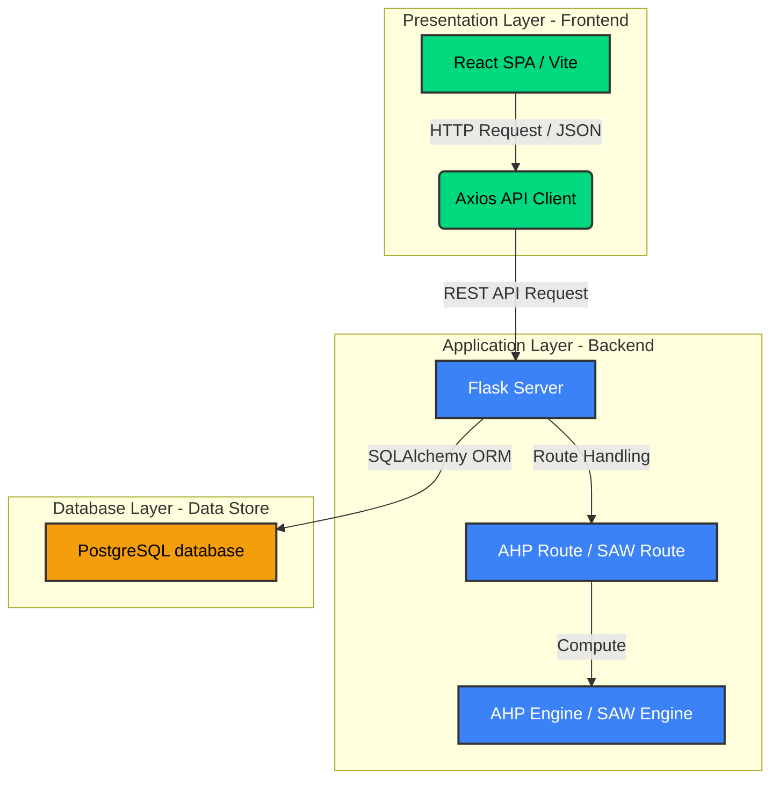
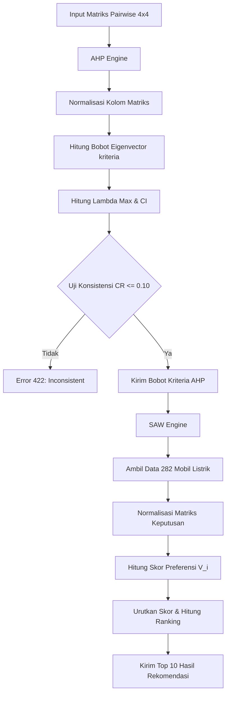

# BAB III: ARSITEKTUR DAN PERENCANAAN SISTEM

Dokumen ini menjelaskan secara mendalam arsitektur sistem, rancangan basis data, pemodelan matematis untuk modul pendukung keputusan, implementasi antarmuka pengguna, serta skenario deployment pada Sistem Pendukung Keputusan (SPK) EVFinder untuk pemilihan mobil listrik terbaik menggunakan metode integrasi AHP (Analytic Hierarchy Process) dan SAW (Simple Additive Weighting).

---

## 3.3.1 Arsitektur Three-Tier (Frontend, Backend, Database)

Sistem SPK EVFinder dirancang menggunakan arsitektur **Three-Tier Architecture** (Arsitektur Tiga Lapis) yang memisahkan tanggung jawab sistem menjadi tiga lapisan logis utama: *Presentation Layer*, *Application/Logic Layer*, dan *Database/Data Layer*. Penerapan arsitektur ini menjamin modularitas, skalabilitas, dan kemudahan pemeliharaan kode program.



### 1. Presentation Layer (Frontend)
Diimplementasikan menggunakan **React.js** (dikompilasi dengan bundler **Vite** sebagai Single Page Application). Lapisan ini bertugas menyajikan antarmuka pengguna (UI), menangkap interaksi masukan (input slider perbandingan kriteria), melakukan kalkulasi konsistensi AHP lokal secara dinamis, serta memvisualisasikan hasil perankingan. Komunikasi ke backend dilakukan secara asinkron menggunakan pustaka **Axios** melalui protokol HTTP (RESTful API).

### 2. Application Layer (Backend / Logic)
Diimplementasikan menggunakan **Flask (Python)**. Lapisan ini bertugas memproses logika bisnis utama, yang mencakup:
- **AHP Engine**: Memvalidasi matriks perbandingan berpasangan (pairwise comparison matrix) yang dikirimkan oleh frontend, menghitung bobot prioritas kriteria, serta melakukan pengujian konsistensi matematis melalui *Consistency Ratio* (CR).
- **SAW Engine**: Mengambil data spesifikasi mobil listrik dari database, menormalisasi matriks keputusan berdasarkan jenis kriteria (benefit/cost), melakukan perkalian matriks dengan bobot kriteria AHP, menyusun ranking 10 alternatif teratas, dan menghitung analisis statistik.

### 3. Database Layer (Data Store)
Lapisan penyimpanan data menggunakan **PostgreSQL** yang dihosting secara *cloud-native* pada layanan **Neon Tech** (menggunakan koneksi SSL aman). Lapisan ini menyimpan data spesifikasi teknis mobil listrik, riwayat pengguna, serta sesi hasil kalkulasi keputusan. Pengaksesan data dari backend Flask dijembatani oleh **SQLAlchemy ORM** (Object-Relational Mapping) untuk efisiensi kueri database.

---

## 3.3.2 Tech Stack (Flask, React, PostgreSQL, Chart.js)

Pemilihan komponen teknologi pada SPK EVFinder disesuaikan dengan kebutuhan performa tinggi, skalabilitas, dan kemudahan integrasi analisis data numerik:

| Komponen Stack | Teknologi | Alasan Pemilihan & Peran Sistem |
| :--- | :--- | :--- |
| **Frontend Framework** | **React (JavaScript / Vite)** | Menyediakan performa rendering yang sangat cepat berkat *Virtual DOM*, arsitektur berbasis komponen (*component-based*) yang mudah digunakan kembali, dan build time instan dengan *Hot Module Replacement* (HMR) bawaan Vite. |
| **Backend Framework** | **Flask (Python)** | Pilihan micro-framework Python yang sangat ringan (*lightweight*), tidak membebani memori server, dan sangat mudah diintegrasikan dengan pustaka komputasi numerik Python (seperti **Pandas** dan **NumPy**) untuk memproses matriks keputusan SPK. |
| **Database** | **PostgreSQL (Neon Tech)** | Sistem Manajemen Basis Data Relasional (RDBMS) yang tangguh dengan dukungan penuh terhadap transaksi ACID, tipe data JSON/JSONB untuk menyimpan hasil perankingan secara fleksibel, dan fitur serverless database pada Neon yang mampu melakukan autoscaling secara instan. |
| **Visualisasi Data** | **Chart.js (React-Chartjs-2)** | Pustaka grafik berbasis HTML5 Canvas yang sangat interaktif dan responsif. Digunakan untuk merender grafik batang (*Bar Chart*) perbandingan skor alternatif serta grafik radar (*Radar Chart*) penyebaran bobot kriteria. |

---

## 3.3.3 Modul Backend: AHP Engine & SAW Engine

Modul backend membagi proses pengambilan keputusan menjadi dua tahap komputasi terpisah: **AHP** untuk pembobotan kriteria dan **SAW** untuk penilaian alternatif.



### 1. AHP Engine (`services/ahp_engine.py`)
Mesin AHP bertugas memproses matriks perbandingan berpasangan berbentuk $4 \times 4$ untuk empat kriteria utama: **Harga (C1)**, **Jarak Tempuh / Range (C2)**, **Kecepatan Puncak / Top Speed (C3)**, dan **Kapasitas Baterai (C4)**.

#### **Langkah-Langkah Matematis AHP:**
1. **Normalisasi Matriks Perbandingan**:
   Membagi setiap nilai sel matriks dengan jumlah kolom yang bersesuaian:
   $$a'_{ij} = \frac{a_{ij}}{\sum_{k=1}^{n} a_{kj}}$$
   
2. **Kalkulasi Bobot Kriteria ($w_i$)**:
   Menghitung nilai rata-rata baris hasil normalisasi untuk mendapatkan bobot kriteria (*eigenvector*):
   $$w_i = \frac{1}{n} \sum_{j=1}^{n} a'_{ij}$$

3. **Pengujian Konsistensi**:
   - Menghitung nilai $\lambda_{max}$ (eigenvalue maksimum):
     $$\lambda_{max} = \frac{1}{n} \sum_{i=1}^{n} \frac{(A \cdot w)_i}{w_i}$$
   - Menghitung *Consistency Index* (CI):
     $$CI = \frac{\lambda_{max} - n}{n - 1}$$
   - Menghitung *Consistency Ratio* (CR):
     $$CR = \frac{CI}{RI}$$
     *Catatan:* Untuk matriks ukuran $n=4$, nilai *Random Index* (RI) yang digunakan adalah **0.90**. Jika $CR \le 0.10$, maka matriks konsisten dan bobot dapat digunakan.

---

### 2. SAW Engine (`services/saw_engine.py`)
Mesin SAW bertugas menormalisasi dan menghitung skor akhir untuk seluruh alternatif mobil listrik yang ada di database.

#### **Langkah-Langkah Matematis SAW:**
1. **Normalisasi Matriks Keputusan ($r_{ij}$)**:
   - Untuk kriteria **Cost (Harga)**, nilai yang lebih kecil dinilai lebih baik:
     $$r_{ij} = \frac{\min(X_{j})}{x_{ij}}$$
   - Untuk kriteria **Benefit (Range, Top Speed, Baterai)**, nilai yang lebih besar dinilai lebih baik:
     $$r_{ij} = \frac{x_{ij}}{\max(X_{j})}$$

2. **Kalkulasi Skor Preferensi ($V_i$)**:
   Mengalikan matriks normalisasi dengan bobot kriteria ($w_j$) yang diperoleh dari perhitungan AHP:
   $$V_i = \sum_{j=1}^{m} w_j \cdot r_{ij}$$
   Alternatif diurutkan berdasarkan nilai $V_i$ dari yang terbesar hingga terkecil untuk menentukan peringkat akhir mobil listrik.

---

## 3.3.4 Implementasi Frontend (Form Pairwise, Chart, Ranking Table)

Antarmuka frontend SPK EVFinder dirancang interaktif untuk memudahkan pengambilan keputusan dengan membagi alur menjadi tiga tahapan (tabs):

### 1. Form Pairwise (Langkah 1)
- **Komponen**: `components/AHPForm.jsx`
- **Fitur**: 
  - Menyediakan **6 slider perbandingan** yang mewakili kombinasi pasangan kriteria.
  - Setiap slider memiliki rentang nilai 1 hingga 17 (mewakili skala Saaty $9, 8, \dots, 2, 1, 2, \dots, 8, 9$ dari kiri ke kanan).
  - Melakukan kalkulasi **Consistency Ratio (CR)** secara real-time di sisi client. Jika logika masukan bertentangan (misal: A > B, B > C, tetapi C > A sehingga $CR > 0.10$), sistem menampilkan peringatan berwarna merah dan mengunci tombol kalkulasi.
  - Menyediakan 5 *preset chips* (Seimbang, Prioritas Harga, Prioritas Jarak Tempuh, Prioritas Kecepatan, dan Optimal EV) sebagai template konfigurasi instan.

### 2. Tabel Rekomendasi / Ranking (Langkah 2)
- **Komponen**: `components/RankingTable.jsx`
- **Fitur**:
  - Menampilkan **Top 10 Mobil Listrik** terbaik hasil kalkulasi SAW.
  - Dua mode tampilan yang dapat ditukar secara dinamis: **Card Grid** (tampilan kartu visual yang modern dengan ilustrasi mobil) dan **Tabel Tradisional** (tampilan baris kolom yang padat data akademis).
  - Fitur **Pencarian Real-time** untuk memfilter hasil rekomendasi berdasarkan nama mobil listrik.
  - Fitur **Ekspor Laporan**: Tombol ekspor data ke format **CSV** dan cetak dokumen laporan resmi terformat **PDF** (lengkap dengan tanggal cetak, parameter bobot kriteria AHP, dan rasio konsistensinya).
  - **Modal Spesifikasi Detail**: Saat kartu mobil diklik, modal pop-up interaktif (menggunakan React Portal) akan terbuka untuk menampilkan spesifikasi teknis lengkap beserta skor kecocokan SAW dalam format progress bar.

### 3. Analisis Visual / Chart (Langkah 3)
- **Komponen**: `components/Charts.jsx`
- **Fitur**:
  - **Bar Chart**: Visualisasi perbandingan skor kecocokan Top 10 alternatif menggunakan grafik batang Chart.js. Dilengkapi dengan *plugins custom* untuk merender **Garis Rata-rata (Average Line)** putus-putus berwarna hijau secara dinamis di atas grafik.
  - **Radar Chart**: Visualisasi profil bobot kriteria hasil perhitungan AHP. Memudahkan pengguna melihat fokus prioritas mereka secara visual (apakah cenderung condong ke aspek ekonomi/harga atau ke performa/baterai).

---

## 3.3.5 Perancangan Basis Data (Database Design)

Basis data SPK EVFinder terdiri dari tiga tabel utama yang saling berelasi untuk mengelola spesifikasi kendaraan, pengguna, dan riwayat hasil keputusan.

```mermaid
erDiagram
    vehicles {
        int id PK
        string name UNIQUE
        float price
        float range
        float top_speed
        float battery
        timestamp created_at
    }
    users {
        int id PK
        string session_id UNIQUE
        timestamp created_at
    }
    results_history {
        int id PK
        int user_id FK
        float weight_price
        float weight_range
        float weight_top_speed
        float weight_battery
        float consistency_ratio
        json ranking_results
        int total_vehicles_processed
        timestamp created_at
    }
    users ||--o{ results_history : "has history"
```

### 1. Tabel `vehicles` (Penyimpanan Data 282 Mobil Listrik)
Menampung data spesifikasi teknis mobil listrik hasil ekstraksi (*parsing*) berkas `electric_cars.csv` setelah melalui tahap pembersihan data kosong (*null-values*) dan duplikasi nama.
- `id` (INTEGER, Primary Key, Auto Increment)
- `name` (VARCHAR(255), Unique, Not Null)
- `price` (DOUBLE PRECISION, Not Null) - *Mewakili kriteria harga jual (cost)*
- `range` (DOUBLE PRECISION, Not Null) - *Mewakili kriteria jarak tempuh (benefit)*
- `top_speed` (DOUBLE PRECISION, Not Null) - *Mewakili kriteria kecepatan maksimum (benefit)*
- `battery` (DOUBLE PRECISION, Not Null) - *Mewakili kriteria kapasitas baterai (benefit)*
- `created_at` (TIMESTAMP, Default: UTC Now)

### 2. Tabel `users` (Manajemen Sesi Pengguna)
Digunakan untuk mencatat pengguna berdasarkan pengidentifikasi sesi unik (*session ID*).
- `id` (INTEGER, Primary Key, Auto Increment)
- `session_id` (VARCHAR(255), Unique)
- `created_at` (TIMESTAMP, Default: UTC Now)

### 3. Tabel `results_history` (Log Riwayat Hasil Keputusan)
Menyimpan riwayat hasil kalkulasi keputusan pengguna beserta parameter pembobotan AHP dan daftar mobil listrik terbaik yang dihasilkan.
- `id` (INTEGER, Primary Key, Auto Increment)
- `user_id` (INTEGER, Foreign Key terhubung ke `users.id`, Nullable)
- `weight_price` (DOUBLE PRECISION) - *Bobot akhir kriteria harga*
- `weight_range` (DOUBLE PRECISION) - *Bobot akhir kriteria range*
- `weight_top_speed` (DOUBLE PRECISION) - *Bobot akhir kriteria kecepatan*
- `weight_battery` (DOUBLE PRECISION) - *Bobot akhir kriteria baterai*
- `consistency_ratio` (DOUBLE PRECISION) - *Nilai CR dari matriks input*
- `ranking_results` (JSON / JSONB) - *Menyimpan daftar peringkat final terhitung dalam bentuk array JSON*
- `total_vehicles_processed` (INTEGER) - *Jumlah mobil listrik yang ikut diproses dalam kalkulasi*
- `created_at` (TIMESTAMP, Default: UTC Now)

---

## 3.3.6 Skenario Deployment (Docker, Gunicorn, & Optimalisasi Performa)

Sistem SPK EVFinder dirancang untuk dideploy pada lingkungan server produksi kontainer yang stabil, aman, dan responsif.

### 1. Kontainerisasi dengan Docker
Sistem dikemas ke dalam kontainer Docker untuk memastikan ketergantungan pustaka (*dependencies*) berjalan konsisten di lingkungan lokal maupun *staging/cloud production*.

**Dockerfile Backend (`backend/Dockerfile`):**
```dockerfile
FROM python:3.10-slim

WORKDIR /app

# Install system dependencies
RUN apt-get update && apt-get install -y --no-install-recommends \
    build-essential \
    libpq-dev \
    && rm -rf /var/lib/apt/lists/*

COPY requirements.txt .
RUN pip install --no-cache-dir -r requirements.txt

COPY . .

# Expose port Flask
EXPOSE 5000

# Run dengan Gunicorn WSGI Server
CMD ["gunicorn", "--workers=4", "--bind=0.0.0.0:5000", "app:app"]
```

---

### 2. WSGI Server: Gunicorn
Pada lingkungan produksi, Flask tidak boleh dijalankan dengan server bawaan (*development server*) karena bersifat single-threaded dan tidak aman. SPK ini menggunakan **Gunicorn (Green Unicorn)** sebagai HTTP Server WSGI produksi:
- **Workers Configuration**: Menggunakan opsi `--workers=4` (rumus: $2 \times \text{Jumlah Core CPU} + 1$). Struktur multi-proses ini menjamin jika salah satu worker mengalami kendala crash saat mengolah data numerik, worker lain tetap aktif melayani API request pengguna tanpa menyebabkan *downtime*.
- **Process Management**: Gunicorn bertindak sebagai master process yang mengelola siklus hidup worker process, mendistribusikan lalu lintas jaringan secara merata, serta menjaga stabilitas penggunaan memori.

---

### 3. Optimalisasi Response Time < 1 Detik
SPK EVFinder menargetkan waktu respons API (*response time*) di bawah 1 detik untuk menjamin kenyamanan navigasi pengguna. Skenario optimalisasi yang dilakukan meliputi:

1. **Vektorisasi Perhitungan dengan Pandas & NumPy**:
   - Seluruh perhitungan normalisasi matriks SAW dan perkalian skor akhir dilakukan menggunakan operasi vektor teroptimasi bahasa C bawaan Pandas/NumPy, bukan perulangan biasa (*looping* `for` di Python). 
   - Hal ini membuat proses perankingan terhadap **282 alternatif mobil listrik** di backend selesai dalam waktu **< 5 milidetik**.

2. **Koneksi Database Teroptimasi (Neon Connection Pooling)**:
   - Penggunaan koneksi serverless PostgreSQL Neon yang mendukung *pooling* koneksi (melalui PgBouncer bawaan Neon) meminimalisir overhead waktu pembuatan koneksi TCP baru dari backend ke database saat menangani kalkulasi konkuren.
   - Mengatur indeks PostgreSQL pada kolom-kolom pencarian dan filter untuk mempercepat pembacaan data.

3. **Penyederhanaan Payload API**:
   - Backend Flask hanya mengirimkan data ringkas Top 10 hasil rekomendasi (`top_10`) beserta metadata statistik dasar ke frontend, bukan seluruh 282 baris data mentah. Ini memperkecil ukuran transmisi data JSON (payload) di jaringan internet sehingga parsing data di sisi browser React menjadi sangat instan.

4. **Kalkulasi Sisi Klien untuk Validasi AHP**:
   - Validasi kelayakan konsistensi input matriks ($CR \le 0.10$) dijalankan langsung secara lokal di browser pengguna menggunakan JavaScript (pada `AHPForm.jsx`) sebelum dikirimkan ke server. Hal ini menghemat panggilan API request yang tidak perlu (*unnecessary round-trips*) ke backend Flask.
