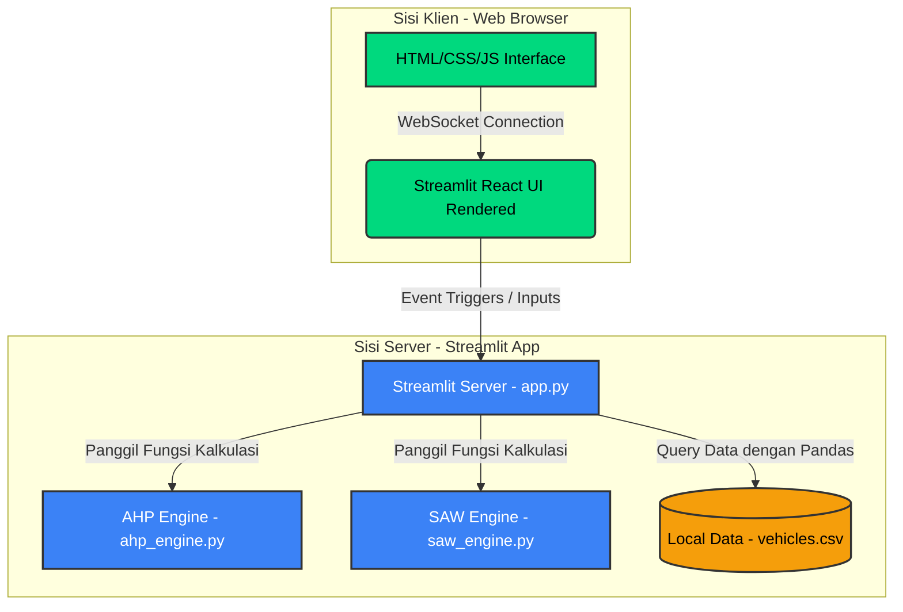
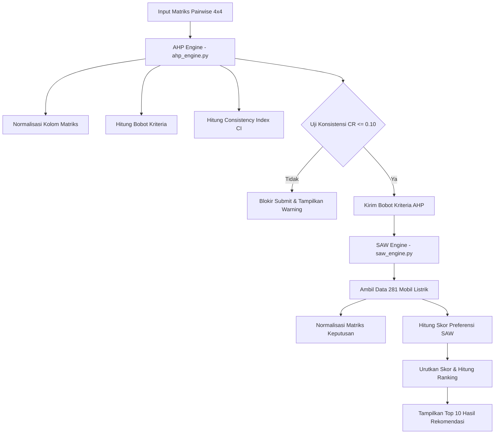

# BAB III: ARSITEKTUR DAN PERENCANAAN SISTEM

Dokumen ini menjelaskan secara mendalam arsitektur sistem, rancangan basis data, pemodelan matematis untuk modul pendukung keputusan, implementasi antarmuka pengguna, serta skenario deployment pada Sistem Pendukung Keputusan (SPK) EVFinder untuk pemilihan mobil listrik terbaik menggunakan metode integrasi AHP (Analytic Hierarchy Process) dan SAW (Simple Additive Weighting).

---

## 3.3.1 Arsitektur Sistem Terintegrasi (Single-Tier Streamlit Monolithic)

Sistem SPK EVFinder dirancang menggunakan pendekatan **Single-Tier Monolithic Architecture** terintegrasi berbasis **Streamlit**. Pendekatan ini menyatukan *Presentation Layer* (antarmuka pengguna) dan *Application Layer* (logika komputasi AHP & SAW) ke dalam satu kesatuan kode program Python. Komunikasi antara antarmuka di peramban (browser) dan server backend dijembatani secara real-time via koneksi **WebSocket**.



### 1. Presentation Layer (Antarmuka Pengguna Klien)
Sisi klien berupa halaman web interaktif berbasis React yang dirender secara otomatis oleh mesin Streamlit di browser pengguna. Lapisan ini bertugas menampilkan slider perbandingan kriteria, menampilkan tabel hasil rekomendasi mobil listrik secara dinamis, serta menyajikan grafik analisis statistik.

### 2. Application Layer (Logika Program & Perhitungan)
Seluruh logika kalkulasi dan alur aplikasi ditangani oleh Python di sisi server:
- **AHP Engine**: Memproses input slider perbandingan berpasangan (pairwise comparison) dari pengguna, menghitung bobot prioritas kriteria, dan melakukan pengecekan rasio konsistensi secara dinamis melalui *Consistency Ratio* (CR).
- **SAW Engine**: Mengambil data spesifikasi mobil listrik, menormalisasi data sesuai kriteria benefit/cost, mengalikan dengan bobot kriteria AHP, menyusun ranking alternatif, dan menyajikan metrik statistik keputusan.

### 3. Data Layer (Penyimpanan Data Lokal)
Data spesifikasi mobil listrik disimpan secara lokal dalam format berkas terstruktur **CSV (`vehicles.csv`)**. Data ini dibaca langsung ke dalam memori server sebagai Pandas DataFrame saat aplikasi pertama kali dijalankan. Hal ini menghilangkan overhead waktu akses jaringan (network latency) database eksternal dan mempercepat respon kalkulasi secara signifikan.

---

## 3.3.2 Tech Stack (Streamlit, Python, Pandas, Plotly)

Pemilihan teknologi pada SPK EVFinder disesuaikan untuk efisiensi komputasi numerik, kecepatan respons aplikasi, dan kesederhanaan deployment:

| Komponen Stack | Teknologi | Alasan Pemilihan & Peran Sistem |
| :--- | :--- | :--- |
| **Frontend & UI Rendering** | **Streamlit React UI** | Menggunakan Streamlit yang menghasilkan antarmuka pengguna berbasis React secara reaktif langsung dari sintaks Python. Menghilangkan kebutuhan untuk mengembangkan frontend terpisah (seperti React/Vite) dan mempermudah pengelolaan status (state) aplikasi. |
| **Aplikasi & Logika Utama** | **Python 3.12 (Streamlit Server)** | Berfungsi sebagai pengelola alur logika aplikasi, menerima input slider kriteria, memanggil engine AHP & SAW, serta mengontrol visualisasi halaman secara real-time. |
| **Penyimpanan Data (Data Store)** | **Pandas DataFrame & CSV (vehicles.csv)** | Memanfaatkan penyimpanan lokal berbasis file CSV yang dibaca langsung ke dalam memori sebagai Pandas DataFrame. Solusi ini sangat efisien, cepat, dan handal untuk dataset berukuran sedang (281 mobil listrik) tanpa overhead database eksternal. |
| **Visualisasi Data** | **Plotly (plotly.graph_objects / plotly.express)** | Pustaka visualisasi data yang canggih, responsif, dan interaktif di Python. Digunakan untuk merender Grafik Batang perbandingan skor SAW dan Grafik Radar profil perbandingan spesifikasi Top 3 mobil listrik. |

---

## 3.3.3 Modul Backend: AHP Engine & SAW Engine

Modul komputasi dibagi menjadi dua file mesin terpisah untuk menjaga kebersihan dan modularitas kode program.



### 1. AHP Engine (`ahp_engine.py`)
Mesin AHP bertugas memproses matriks perbandingan berpasangan berbentuk $4 \times 4$ untuk empat kriteria utama: **Harga (C1)**, **Jarak Tempuh / Range (C2)**, **Kecepatan Puncak / Top Speed (C3)**, dan **Kapasitas Baterai (C4)**.

#### **Langkah-Langkah Matematis AHP:**
1. **Normalisasi Matriks Perbandingan**:
   Membagi setiap nilai sel matriks dengan jumlah kolom yang bersesuaian:
   $$a'_{ij} = \frac{a_{ij}}{\sum_{k=1}^{n} a_{kj}}$$
   
2. **Kalkulasi Bobot Kriteria ($w_i$)**:
   Menghitung nilai rata-rata baris hasil normalisasi untuk mendapatkan bobot kriteria (*eigenvector*):
   $$w_i = \frac{1}{n} \sum_{j=1}^{n} a'_{ij}$$

3. **Pengujian Konsistensi**:
   - Menghitung nilai $\lambda_{max}$ (eigenvalue maksimum):
     $$\lambda_{max} = \frac{1}{n} \sum_{i=1}^{n} \frac{(A \cdot w)_i}{w_i}$$
   - Menghitung *Consistency Index* (CI):
     $$CI = \frac{\lambda_{max} - n}{n - 1}$$
   - Menghitung *Consistency Ratio* (CR):
     $$CR = \frac{CI}{RI}$$
     *Catatan:* Untuk matriks kriteria ukuran $n=4$, nilai *Random Index* (RI) yang digunakan adalah **0.90**. Jika $CR \le 0.10$, matriks dinyatakan konsisten. Jika tidak, proses dihentikan dan user harus merevisi nilai inputnya.

---

### 2. SAW Engine (`saw_engine.py`)
Mesin SAW bertugas menormalisasi kriteria dan menghitung skor preferensi untuk semua alternatif mobil listrik.

#### **Langkah-Langkah Matematis SAW:**
1. **Normalisasi Matriks Keputusan ($r_{ij}$)**:
   - Untuk kriteria **Cost (Harga)**, nilai yang lebih kecil dinilai lebih baik:
     $$r_{ij} = \frac{\min(X_{j})}{x_{ij}}$$
     *Pencegahan pembagian nol:* Jika nilai minimum kriteria cost bernilai 0, maka baris alternatif yang bernilai 0 akan bernilai 1.0 (sempurna) dan alternatif lainnya bernilai 0.0.
   - Untuk kriteria **Benefit (Range, Top Speed, Baterai)**, nilai yang lebih besar dinilai lebih baik:
     $$r_{ij} = \frac{x_{ij}}{\max(X_{j})}$$

2. **Kalkulasi Skor Preferensi ($V_i$)**:
   Mengalikan matriks normalisasi dengan bobot kriteria ($w_j$) yang diperoleh dari perhitungan AHP:
   $$V_i = \sum_{j=1}^{m} w_j \cdot r_{ij}$$
   Alternatif kemudian diurutkan berdasarkan skor $V_i$ dari yang tertinggi ke terendah untuk menentukan peringkat rekomendasi.

---

## 3.3.4 Implementasi Antarmuka Pengguna (Frontend Streamlit)

Antarmuka pengguna dirancang terintegrasi ke dalam 3 langkah tahapan (*stage*) interaktif pada berkas utama `app.py`:

### 1. Form Pairwise & Slider AHP (Langkah 1)
- **Komponen**: Halaman masukan kriteria pada `app.py`.
- **Fitur**:
  - Menyediakan **4 slider perbandingan berpasangan langsung** untuk menentukan prioritas kriteria.
  - Skala slider dibatasi dari **-4 hingga +4** untuk menjaga rasionalitas perbandingan kriteria.
  - Menampilkan perhitungan **Consistency Ratio (CR)** secara dinamis. Jika masukan tidak konsisten ($CR > 0.10$), sistem menampilkan pesan peringatan merah dan menonaktifkan tombol submit.
  - Dilengkapi *warning block* jika nilai turunan perbandingan melebihi batas skala Saaty (>9.0).
  - Menyediakan *preset buttons* (Seimbang, Prioritas Harga, Prioritas Jarak Tempuh, dll.) untuk konfigurasi cepat.

### 2. Tabel Pemeringkatan SAW (Langkah 2)
- **Komponen**: Tabel rekomendasi pada `app.py`.
- **Fitur**:
  - Menampilkan **Top 10 Mobil Listrik Terbaik** hasil perhitungan SAW menggunakan tabel HTML/CSS kustom yang bersih dan modern.
  - Menyediakan kolom interaktif: Peringkat, Nama Mobil, Harga (EUR), Jarak Tempuh (km), Kecepatan (km/h), Kapasitas Baterai (kWh), dan Skor SAW.
  - Fitur **Pencarian Real-time** untuk mencari mobil listrik tertentu dari database 281 data secara instan menggunakan text input.

### 3. Analisis Visual & Statistik (Langkah 3)
- **Komponen**: Visualisasi grafik pada `app.py`.
- **Fitur**:
  - **Bar Chart**: Grafik batang interaktif menggunakan Plotly untuk membandingkan skor SAW dari Top 10 alternatif mobil listrik.
  - **Radar Chart**: Grafik radar polar Plotly untuk membandingkan profil spesifikasi ternormalisasi dari Top 3 alternatif mobil listrik teratas secara visual.
  - **Ringkasan Keputusan**: Kartu metrik berisi statistik berupa Rekomendasi Utama, Skor Tertinggi, Skor Alternatif Ke-10, dan Total Pilihan Mobil.

---

## 3.3.5 Perancangan Data (Data Design)

Penyimpanan data pada aplikasi SPK EVFinder disederhanakan dengan tidak menggunakan basis data relasional eksternal (PostgreSQL), melainkan menggunakan penyimpanan data flat file berbasis berkas **CSV (`vehicles.csv`)**.

### Struktur Data Berkas `vehicles.csv`
Berkas ini bertindak sebagai basis data tunggal yang menyimpan spesifikasi teknis dari **281 mobil listrik unik** yang telah dibersihkan dari nilai kosong (null) dan duplikasi:

| Nama Kolom (CSV) | Tipe Data | Peran & Kriteria SPK | Keterangan |
| :--- | :--- | :--- | :--- |
| `name` | String | Alternatif | Nama merek dan model mobil listrik (Unique) |
| `price` | Float / Double | C1: Harga (Cost) | Harga jual mobil listrik dalam satuan EUR |
| `range` | Float / Double | C2: Jarak Tempuh (Benefit) | Kemampuan jarak tempuh maksimal dalam satuan km |
| `top_speed` | Float / Double | C3: Kecepatan (Benefit) | Kecepatan maksimum mobil dalam satuan km/h |
| `battery` | Float / Double | C4: Baterai (Benefit) | Kapasitas baterai kendaraan dalam satuan kWh |

### Proses Pembacaan Data
Pembacaan data dilakukan secara langsung melalui *Pandas I/O* di `app.py`:
```python
def load_data():
    return pd.read_csv("vehicles.csv")
```
DataFrame ini kemudian disimpan dalam memori aplikasi dan siap digunakan untuk operasi normalisasi dan perankingan metode SAW secara real-time.

---

## 3.3.6 Skenario Deployment & Optimalisasi Performa

Aplikasi dideploy ke lingkungan produksi berbasis cloud menggunakan integrasi Git dan platform serverless.

### 1. Deployment ke Streamlit Community Cloud
Proses deployment dilakukan melalui platform **Streamlit Community Cloud** yang terintegrasi langsung dengan repository GitHub:
- **Repository Source**: GitHub (`github.com/Bagaspermana0/SPK_EV`) pada branch `main`.
- **Mekanisme CI/CD**: Setiap kali ada pembaruan kode yang di-push ke GitHub, Streamlit Cloud akan secara otomatis menarik kode terbaru dan membangun ulang (rebuild) lingkungan aplikasi.
- **Dependency Management**: Streamlit Cloud membaca file `requirements.txt` dan menginstal otomatis pustaka dependensi (`streamlit`, `pandas`, `numpy`, `plotly`) secara serverless.

### 2. Optimalisasi Response Time < 1 Detik
Sistem ini menjamin waktu respons aplikasi (*response time*) yang instan (di bawah 0.1 detik) melalui beberapa strategi berikut:

1. **Vektorisasi Operasi dengan NumPy & Pandas**:
   Seluruh kalkulasi normalisasi kriteria SAW dan pembobotan alternatif dilakukan menggunakan operasi vektor teroptimasi bahasa C bawaan NumPy/Pandas. Tidak ada proses perulangan (`for loop` lambat) dalam perhitungan 281 data alternatif, sehingga kalkulasi selesai dalam waktu **< 5 milidetik**.
2. **In-Memory Caching & Local File Access**:
   Karena data mobil listrik tersimpan secara lokal pada file CSV dan dibaca langsung ke dalam RAM, tidak ada hambatan waktu tunggu koneksi jaringan (network latency) ke database eksternal seperti PostgreSQL.
3. **Plotly Client-Side Rendering**:
   Grafik visualisasi (Bar & Radar Chart) dibuat dalam bentuk data JSON di server Streamlit dan dikirimkan ke peramban pengguna untuk dirender di sisi klien menggunakan pustaka WebGL/React Plotly. Ini menghemat bandwidth transmisi data jaringan dan menjaga performa UI tetap responsif.
